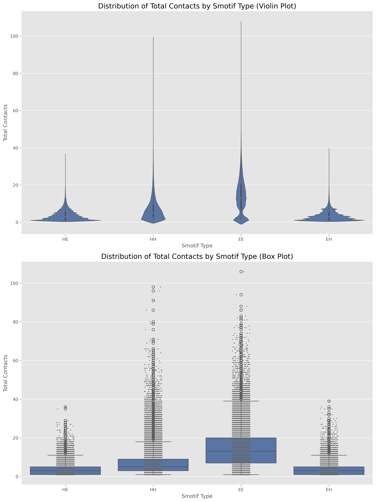

# Analysis of Smotif Contact Distribution

## Summary Statistics

```
               count       mean       std  min  25%   50%   75%    max
smotif_type                                                           
EE           85373.0  13.810772  9.844828  1.0  7.0  13.0  20.0  106.0
EH           44398.0   3.450133  2.828917  1.0  1.0   3.0   5.0   39.0
HE           43270.0   3.664987  2.948038  1.0  1.0   3.0   5.0   36.0
HH           61331.0   7.236732  6.900780  1.0  3.0   5.0   9.0   98.0
```

## Key Observations

1. **Central Tendency:**
   - EE (strand-strand) Smotifs have the highest mean number of contacts (13.81), followed by HH (helix-helix) with 7.24.
   - EH (strand-helix) and HE (helix-strand) have similar, but much lower mean contacts (3.45 and 3.66 respectively).

2. **Variability:**
   - EE Smotifs show the highest standard deviation (9.84), indicating the widest spread of contact numbers.
   - HH Smotifs also show high variability (std dev 6.90).
   - EH and HE have lower and similar variability (std dev 2.83 and 2.95).

3. **Distribution Shape:**
   - The violin plots show that all distributions are right-skewed (longer upper tails).
   - EE and HH distributions are more symmetric and wider compared to EH and HE.
   - EH and HE distributions are heavily skewed towards lower contact numbers.

4. **Range:**
   - EE Smotifs have the widest range (1-106 contacts).
   - HH also has a wide range (1-98 contacts).
   - EH and HE have narrower ranges (1-39 and 1-36 respectively).

5. **Median (50th percentile):**
   - EE: 13.0
   - HH: 5.0
   - EH: 3.0
   - HE: 3.0

6. **Interquartile Range (IQR):**
   - EE has the largest IQR (20 - 7 = 13), indicating high variability in the middle 50% of the data.
   - HH has the second-largest IQR (9 - 3 = 6).
   - EH and HE have small IQRs (5 - 1 = 4), indicating less variability in the middle 50%.

## Conclusions

1. **Strand-Strand Interactions (EE) are the most prevalent:**
   EE Smotifs consistently show the highest number of contacts, suggesting that β-sheets form more extensive interaction networks than other types of secondary structure arrangements.

2. **Helix-Helix Interactions (HH) are the second most common:**
   HH Smotifs have the second-highest number of contacts, indicating that α-helices also form significant interaction networks, though less extensive than β-sheets.

3. **Mixed Interactions (EH and HE) have fewer contacts:**
   The lower number of contacts in EH and HE Smotifs suggests that interactions between helices and strands are less extensive, possibly due to geometric constraints or the nature of these interactions.

4. **High variability in sheet and helix interactions:**
   The large standard deviations and IQRs for EE and HH Smotifs indicate that these interactions can vary greatly in their extent, possibly depending on the specific protein structure or function.

5. **Consistency in mixed interactions:**
   The similar statistics for EH and HE Smotifs suggest that the direction of the interaction (helix-to-strand vs. strand-to-helix) doesn't significantly affect the number of contacts formed.

6. **Potential for extreme cases:**
   The presence of high maximum values, especially for EE and HH, indicates that some Smotifs can form extremely extensive contact networks, which might be important for protein stability or function.

7. **Skewed distributions:**
   The right-skewed nature of all distributions suggests that while most Smotifs have a relatively low number of contacts, there's a tendency for some to form many more contacts than the average.

## Implications

These findings have implications for understanding protein folding, stability, and potentially for protein design. The prevalence of contacts in β-sheet structures (EE) and α-helical interactions (HH) highlights their importance in overall protein architecture. The consistency in mixed interactions (EH/HE) suggests a more standardized interface between these different secondary structure elements.


What is the typical range of SSE length differences we need to handle?  A:
	1.  count       mean       std  min  25%   50%   75%    max
smotif_type                                                           
EE           85373.0  13.810772  9.844828  1.0  7.0  13.0  20.0  106.0
EH           44398.0   3.450133  2.828917  1.0  1.0   3.0   5.0   39.0
HE           43270.0   3.664987  2.948038  1.0  1.0   3.0   5.0   36.0
HH           61331.0   7.236732  6.900780  1.0  3.0   5.0   9.0   98.0
2: Is it more important to prioritize speed or accuracy in the binning process?
A: Accuracy is more important than speed

3. Are there any specific structural features of Smotifs that we should pay special attention to during comparison? A: I want to bin the smotifs by RMSD and then by Contacts. then, I will extract the sequence profiles of these bins and then create a training dataset to establish the link between sequence and smotifs.
4. How should we handle cases where Smotifs have very different total lengths but similar core structures? A:  they should be in the same bin, but there should be a threshold i.e the residues dropped out for rmsd calculation shouldn't be like 10-15% of the native residues.